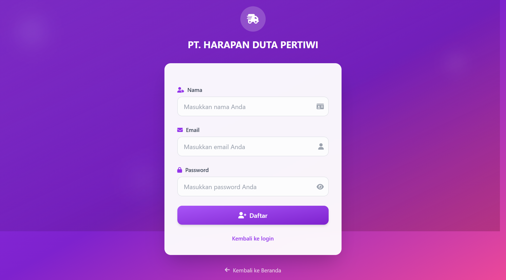
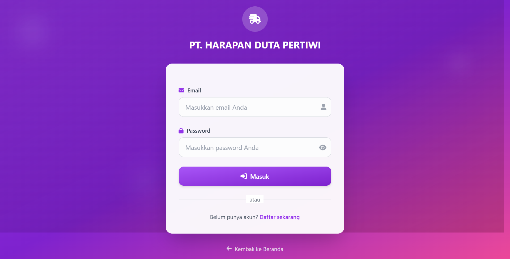
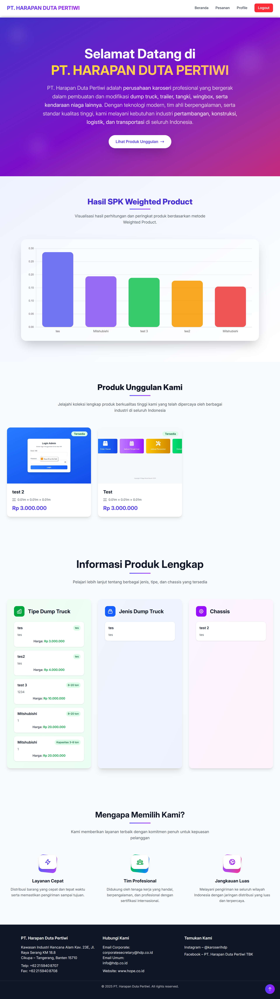
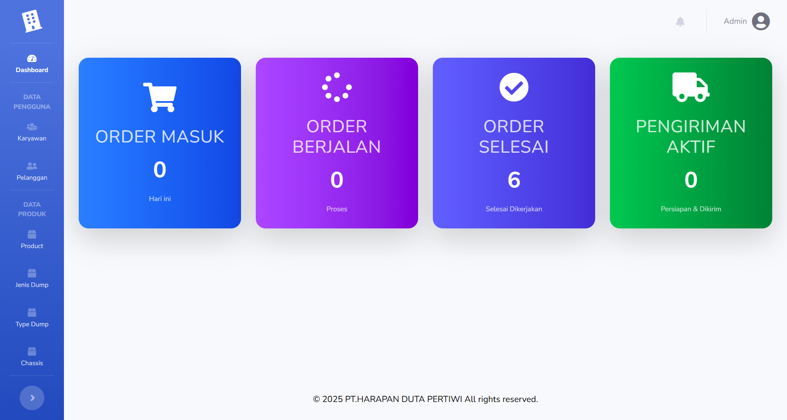

# 🚛 Sistem Informasi Penjualan Karoseri Dump Truck

<div align="center">


*Sistem manajemen penjualan karoseri dump truck yang modern, efisien, dan real-time*

</div>

---

## 🖼️ Tampilan Antarmuka

### 🔐 Register & Login (Web)

<p align="center">
  
  
</p>

---

### 🏠 Halaman Utama (Customer, Admin, Sales)

<p align="center">
  
  
  
</p>

---

## 📋 Deskripsi Proyek

Sistem Informasi Penjualan Karoseri Dump Truck adalah solusi komprehensif yang dikembangkan untuk mengoptimalkan proses bisnis penjualan produk karoseri. Sistem ini menawarkan pendekatan terstruktur dalam mengelola inventori, pemesanan, dan tracking status produksi dengan antarmuka yang intuitif dan responsif.

### 🎯 **Tujuan Sistem**
- Menyederhanakan alur kerja penjualan karoseri
- Meningkatkan transparansi proses order untuk customer
- Menyediakan dashboard analitik untuk pengambilan keputusan bisnis
- Mengotomatisasi perhitungan harga dan dokumentasi transaksi

---

## ✨ Fitur Unggulan

### 🏭 **Manajemen Produk Komprehensif**
- **Katalog Produk**: Pengelolaan data Type, Jenis, dan Chassis secara hierarkis
- **Spesifikasi Detail**: Input spesifikasi teknis lengkap untuk setiap produk
- **Relasi Dinamis**: Sistem relasi antar kategori untuk kemudahan pencarian
- **Inventory Tracking**: Monitoring stok dan ketersediaan produk

### 📋 **Sistem Pemesanan Terintegrasi**
- **Sales Order Builder**: Interface drag-and-drop untuk pembuatan order
- **Kalkulasi Otomatis**: Perhitungan harga, diskon, dan pajak secara real-time
- **Multi-Payment Support**: Dukungan berbagai metode pembayaran
- **Document Management**: Upload dan preview bukti pembayaran dengan validasi

### 📊 **Workflow Management**
- **Status Tracking**: Pelacakan status dari order → approval → produksi → delivery
- **Timeline Visualization**: Visualisasi progress order dalam bentuk timeline
- **Automated Notifications**: Notifikasi otomatis untuk setiap perubahan status
- **Audit Trail**: Log lengkap aktivitas untuk compliance dan tracking

### 📈 **Dashboard & Analytics**
- **Real-time Metrics**: KPI dashboard dengan update real-time
- **Visual Reporting**: Grafik interaktif untuk analisis penjualan
- **Custom Filters**: Filter berdasarkan periode, status, atau kategori produk
- **Export Functionality**: Export laporan dalam format Excel/PDF

### 🔔 **Notifikasi Real-time**
- **Pusher Integration**: Update status order tanpa refresh halaman
- **Multi-channel Alerts**: Notifikasi via email, SMS, dan in-app
- **Role-based Notifications**: Notifikasi sesuai peran user (admin, sales, customer)

---

## 🛠️ Tech Stack

| Kategori | Teknologi | Versi | Deskripsi |
|----------|-----------|-------|-----------|
| **Backend** | Laravel | 12.x | Framework PHP modern dengan ecosystem lengkap |
| **Frontend** | Tailwind CSS | 3.x | Utility-first CSS framework untuk UI responsif |
| **Database** | MySQL | 8.0+ | Relational database management system |
| **Build Tool** | Vite | 5.x | Next generation frontend build tool |
| **Real-time** | Pusher | - | WebSocket service untuk notifikasi real-time |
| **UI Components** | SweetAlert2 | - | Beautiful popup notifications |
| **Notifications** | Toastr | - | Non-blocking notifications |

---

## 🚀 Quick Start

### 📋 Prerequisites

Pastikan sistem Anda memiliki:
- PHP >= 8.1
- Composer >= 2.0
- Node.js >= 18.x
- MySQL >= 8.0
- Git

### 🔧 Instalasi

#### 1️⃣ **Clone & Setup Project**
```bash
# Clone repository
git clone https://github.com/luckysergio/project-penjualan-karoseri.git
cd project-penjualan-karoseri

# Install dependencies
composer install
npm install
```

#### 2️⃣ **Environment Configuration**
```bash
# Copy environment file
cp .env.example .env

# Generate application key
php artisan key:generate
```

#### 3️⃣ **Database Setup**
```bash
# Edit .env file dengan konfigurasi database Anda
DB_DATABASE=karoseri_db
DB_USERNAME=your_username
DB_PASSWORD=your_password

# Run migrations dan seeders
php artisan migrate
php artisan db:seed
```

#### 4️⃣ **Build Assets & Run Server**
```bash
# Build frontend assets
npm run dev

# Start development server
php artisan serve
```

#### 5️⃣ **Pusher Configuration (Optional)**
```bash
# Edit .env untuk real-time notifications
PUSHER_APP_ID=your_app_id
PUSHER_APP_KEY=your_key
PUSHER_APP_SECRET=your_secret
PUSHER_APP_CLUSTER=your_cluster
```

---

## 📁 Struktur Project

```
project-penjualan-karoseri/
├── app/
│   ├── Http/Controllers/     # Controllers untuk business logic
│   ├── Models/              # Eloquent models
│   └── Services/            # Business services layer
├── database/
│   ├── migrations/          # Database schema migrations
│   └── seeders/            # Data seeders
├── resources/
│   ├── views/              # Blade templates
│   ├── js/                 # Frontend JavaScript
│   └── css/                # Styles dan Tailwind
├── routes/
│   ├── web.php             # Web routes
│   └── api.php             # API routes
└── public/                 # Public assets
```

---

## 🤝 Contributing

Kami sangat menghargai kontribusi dari komunitas! Untuk berkontribusi:

1. Fork repository ini
2. Buat feature branch (`git checkout -b feature/AmazingFeature`)
3. Commit perubahan (`git commit -m 'Add some AmazingFeature'`)
4. Push ke branch (`git push origin feature/AmazingFeature`)
5. Buka Pull Request

---

## 📝 License

Distributed under the MIT License. See `LICENSE` for more information.

---

## 📞 Contact & Support

### 👨‍💻 **Developer**
**Lucky Sergio**
- 📧 Email: [luckysergio77@gmail.com](mailto:luckysergio77@gmail.com)
- 📱 Instagram: [@lcksr](https://instagram.com/lcksr)
- 💼 LinkedIn: [Lucky Sergio](https://linkedin.com/in/luckysergio)

### 🐛 **Issues & Bug Reports**
Jika Anda menemukan bug atau memiliki saran, silakan buat issue di [GitHub Issues](https://github.com/luckysergio/project-penjualan-karoseri/issues)

### 💬 **Community**
Join komunitas developer Indonesia untuk diskusi dan sharing:
- [Telegram Group](https://t.me/laravel_indonesia)
- [Discord Server](https://discord.gg/laravel)

---

<div align="center">

**⭐ Jika project ini membantu, jangan lupa berikan star! ⭐**

*Made with ❤️ by Lucky Sergio*


</div>
